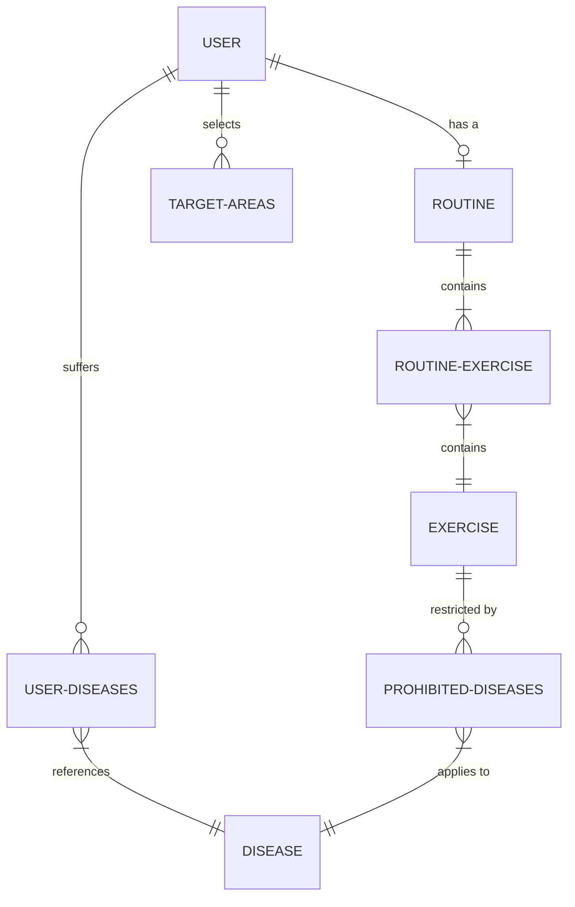

# 🏋️‍♂️ SayaGym - Smart Health & Routine Generator

[](https://dotnet.microsoft.com/)
[](https://learn.microsoft.com/aspnet/core/mvc/)
[](https://learn.microsoft.com/ef/core/)
[](https://getbootstrap.com/)

**SayaGym** is a functional prototype of a physical training and health management web system developed as a university project. The system focuses on solving the common problem of generic workout assignments in gyms, allowing users to **generate personalized, adaptive 4-day workout routines** that dynamically adjust based on user goals, areas of interest, and most importantly, medical conditions or restrictions.

---

## 📌 Table of Contents
1. [Key Features](#-key-features)
2. [Architecture & Technologies](#-architecture--technologies)
3. [Project Structure](#-project-structure)
4. [Routine Generation Logic](#%EF%B8%8F-routine-generation-logic)
5. [Database Model](#%EF%B8%8F-database-model)
6. [Installation & Setup](#%EF%B8%8F-installation--setup)
7. [Portfolio Note](#-portfolio-note)

---

## 🌟 Key Features

*   **Integrated Clinical Profile:** Enables the recording of critical body metrics such as weight, height (to automatically calculate BMI in real-time), and pre-existing conditions like hypertension, asthma, diabetes, or spinal/knee injuries.
*   **Algorithmic Routine Generator:** Automatically creates a weekly 4-day plan with adaptive cardio and muscle toning volume.
*   **Health-Based Exercise Exclusion:** Automatically filters out and excludes physical exercises that could pose a risk to the user's health based on their recorded medical conditions.
*   **Role-Based Access Control (RBAC):** A secure cookie-based authentication system that splits access into three levels:
    *   **Admin:** Full control over users and the base catalog.
    *   **Trainer:** Client supervision and physical progress tracking.
    *   **Client:** Access to their clinical profile, viewing, and downloading of their current workout routine.
*   **Print-Friendly Design:** Includes CSS styles optimized for printing the workout table physically with a single click.
*   **Interactive Details:** Dynamic JavaScript modals to view step-by-step guides and descriptions for each exercise in the routine.

---

## 🛠️ Architecture & Technologies

The project follows the **MVC (Model-View-Controller)** design pattern with a clear separation of concerns:

*   **Core Framework:** .NET 8.0 (C#)
*   **ORM:** Entity Framework Core 8.0 with a *Code-First* approach.
*   **Database:** Microsoft SQL Server (supports local persistence and Azure SQL).
*   **Views & UI:** Razor Views/CSHTML, Bootstrap 5 for responsive design, and native JavaScript for asynchronous manipulation and modals.
*   **Authentication:** ASP.NET Core's built-in Cookie Authentication Middleware.

---

## 📁 Project Structure

The source code structure is organized as follows:

```text
SayaGym/
├── SayaGym.sln                      # Visual Studio solution file
└── SayaGym/                         # Main project folder
    ├── Controllers/                 # MVC flow controllers
    │   ├── HomeController.cs        # Portal home page
    │   ├── LoginController.cs       # Login and logout handling
    │   ├── UsersController.cs       # CRUD and user profile management
    │   └── SaludController.cs       # Core of the adaptive routine generation
    ├── Models/                      # Entities and data models
    │   ├── Usuario.cs               # User profile, roles, validations, and BMI
    │   ├── Rutina.cs                # Header of the generated routine
    │   ├── Ejercicio.cs             # Basic data of each physical exercise
    │   ├── EjercicioRutina.cs       # Relationship linking exercise to routine with assigned day
    │   ├── Enfermedad.cs            # Catalog of medical pathologies
    │   └── ...                      # Intermediate tables for many-to-many relationships
    ├── Data/
    │   └── Contexto.cs              # EF Core DbContext, Fluent API relationships, and seeding
    ├── Views/                       # HTML views with Razor syntax (CSHTML)
    │   ├── Salud/                   # Views for querying and editing health/routine info
    │   ├── Users/                   # Views for user management
    │   ├── Login/                   # Login form
    │   └── Shared/                  # Common layouts and partial table views
    ├── Ejercicios.json              # Preloaded seed data of exercises and restrictions
    ├── wwwroot/                     # Static assets (CSS, JS, images)
    └── Program.cs                   # Middleware pipeline and services startup
```

---

## ⚙️ Routine Generation Logic

The core logic is hosted in [SaludController.cs](file:///home/cold/code/SayaGym/SayaGym/Controllers/SaludController.cs). When a user updates their physical conditions or goals, the system triggers a routine regeneration:

1.  **Safety Filtering:** The list of allowed exercises is queried, removing any that are incompatible with the user's recorded medical conditions.
2.  **Goal-Based Distribution:** 
    *   **Weight Loss:** High cardio volume focus (extended warm-up and cool-down cardio, moderate toning).
    *   **Toning:** High muscle endurance focus (brief cardio for warm-up/cool-down, more toning exercises).
    *   **Maintenance:** A balanced mix of cardio and toning.
3.  **Random Selection Without Duplication:** For each of the 4 days, the algorithm takes the muscle groups selected by the user, picks random exercises without duplicating movements on the same day, and packages them into the final daily routine structure.

---

## 🗄️ Database Model

Entity Framework Core maps the following tables and relationships in SQL Server:



*   **Automatic Data Seeding:** The database context ([Contexto.cs](file:///home/cold/code/SayaGym/SayaGym/Data/Contexto.cs)) automatically reads the [Ejercicios.json](file:///home/cold/code/SayaGym/SayaGym/Ejercicios.json) file during migrations to populate the initial exercise catalog and configure relationships with diseases that restrict them.

---

## 🛠️ Installation & Setup

Follow these steps to set up the local development environment:

### Prerequisites
*   [.NET SDK 8.0](https://dotnet.microsoft.com/download/dotnet/8.0) or higher installed.
*   [SQL Server LocalDB](https://learn.microsoft.com/sql/database-engine/configure-windows/sql-server-express-localdb) or an active SQL Server instance.

### Steps
1.  **Clone the repository:**
    ```bash
    git clone https://github.com/tu-usuario/SayaGym.git
    cd SayaGym
    ```

2.  **Configure the database connection:**
    Open the [SayaGym/appsettings.json](file:///home/cold/code/SayaGym/SayaGym/appsettings.json) file and ensure the connection string points to your local database server:
    ```json
    "ConnectionStrings": {
      "StringConexion": "Server=(localdb)\\mssqllocaldb;Database=SayaGymDb;Trusted_Connection=True;MultipleActiveResultSets=true"
    }
    ```

3.  **Run Migrations:**
    Apply the Entity Framework Core migrations to create tables and seed the initial exercise and disease data:
    ```bash
    dotnet ef database update --project SayaGym
    ```

4.  **Start the Application:**
    Run the local development server:
    ```bash
    dotnet run --project SayaGym
    ```
    Access the web portal by opening your browser to the local address output in the console (typically `https://localhost:7146` or `http://localhost:5242`).

5.  **Default Test Credentials:**
    *   **Email/Username:** `admin@gmail.com`
    *   **Password:** `admin`

---

## 🎓 Portfolio Note

This project represents a functional early-stage prototype, focused on illustrating concepts of:
*   Managing complex relationships in relational databases using Entity Framework Core.
*   Basic server-side decision-making algorithmic logic.
*   Using robust architectural patterns (MVC) within the Microsoft .NET enterprise ecosystem.
